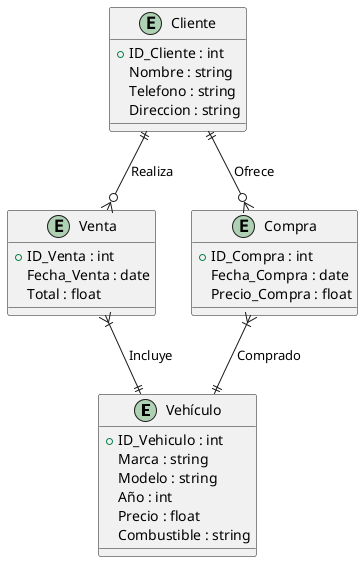

# ProyectoConjuntoGrupo6

## Especificaciones del proyecto

Compra-Venta Coches
Una agencia de vehículos quiere implementar un sistema para gestionar la compra y venta de autos. La agencia necesita registrar la siguiente información:


Vehículos: Cada vehículo tiene un identificador único, marca, modelo, año, precio y tipo de combustible.

Clientes: Los clientes que compran o venden vehículos tienen un identificador único, nombre, número de teléfono y dirección.

Ventas: Cada venta realizada tiene una fecha de venta, el monto total de la venta y el cliente que realiza la compra.

Compras: Cada compra de un vehículo a un cliente tiene una fecha de compra, precio de compra y cliente que realiza la venta.

Relaciones:

Un cliente puede vender varios vehículos a la agencia, pero un vehículo sólo puede ser vendido una vez.
Un cliente puede comprar múltiples vehículos, pero cada venta es independiente.
Cada vehículo puede estar en una de las transacciones (compra o venta).


Solución

@startuml
entity "Vehículo" {
    +ID_Vehiculo : int
    Marca : string
    Modelo : string
    Año : int
    Precio : float
    Combustible : string
}

entity "Cliente" {
    +ID_Cliente : int
    Nombre : string
    Telefono : string
    Direccion : string
}

entity "Venta" {
    +ID_Venta : int
    Fecha_Venta : date
    Total : float
}

entity "Compra" {
    +ID_Compra : int
    Fecha_Compra : date
    Precio_Compra : float
}

' Relación entre entidades
Cliente ||--o{ Venta : Realiza
Cliente ||--o{ Compra : Ofrece
Venta }|--|| Vehículo : Incluye
Compra }|--|| Vehículo : Comprado

@enduml

## Explicación:

Entidad "Vehículo" se conecta a "Venta" y "Compra" para diferenciar entre cuando un vehículo es comprado por la agencia o vendido a un cliente.

Entidad "Cliente" está relacionada con "Venta" y "Compra" para reflejar la transacción correspondiente (compra o venta).
Las relaciones aseguran que un cliente pueda realizar varias ventas o compras, pero cada vehículo sólo estará en una transacción a la vez, de compra o venta.

### Creacion del esqueleto del proyecto

* Creamos el documento **Readme.md**
* Creamos un archivo vacion llamado **package.json** en el cual hemos copiado
  de otro proyecto las dependencias de este y hemos adaptado los datos a 
  nuestro proyecto
* Creamos el **.env** en el cual meteremos las variables necesarias para iniciar
  nuestra conexion a nuestra base de datos

  Los datos necesarios de nuestro .env son los siguientes:

  ```javascript
    MYSQL_PORT=33307
    MYSQL_PORTS=33307:3306
    ADMYNER_PORTS=8182:8080
    SERVICE_PORT=8000


    MYSQL_HOST=localhost
    MYSQL_PORT=33307
    MYSQL_USER=root
    MYSQL_ROOT_PASSWORD=1234
    MYSQL_DATABASE=concesionario
  ```

* Creamos la carpeta stack donde meteremos los ficheros **docker_compose.yml**
  y el fichero **init.db**.

  Los datos de nuestro docker_compose.yml son los siguientes:
  ```yml
    version: '3.1'

    services:

    adminer:
        image: adminer
        restart: "no"
        ports:
        - ${ADMINER_PORT}:8080

    db-concesionario:
        image: mysql:latest
        restart: "no"
        environment:
        MYSQL_ROOT_PASSWORD: ${MYSQL_ROOT_PASSWORD}
        ports:
        - ${MYSQL_PORT}:3306
        volumes:
        - ./scripts:/docker-entrypoint-initdb.d
  ```
  Y los datos de nuestra base de datos son los siguientes:

  ```sql
  CREATE DATABASE IF NOT EXISTS concesionario;

  USE concesionario;


  -- Crear tabla Vehículo
  CREATE TABLE Vehiculo (
      ID_Vehiculo INT PRIMARY KEY,
      Marca VARCHAR(50),
      Modelo VARCHAR(50),
      Anio INT,
      Precio DECIMAL(10, 2),
      Combustible VARCHAR(20)
  );

  -- Crear tabla Cliente
  CREATE TABLE Cliente (
      ID_Cliente INT PRIMARY KEY,
      Nombre VARCHAR(100),
      Telefono VARCHAR(20),
      Direccion VARCHAR(150)
  );

  -- Crear tabla Venta
  CREATE TABLE Venta (
      ID_Venta INT PRIMARY KEY,
      Fecha_Venta DATE,
      Total DECIMAL(10, 2),
      ID_Cliente INT,
      ID_Vehiculo INT,
      FOREIGN KEY (ID_Cliente) REFERENCES Cliente(ID_Cliente) ON DELETE SET NULL,
      FOREIGN KEY (ID_Vehiculo) REFERENCES Vehiculo(ID_Vehiculo) ON DELETE SET NULL
  );

  -- Crear tabla Compra
  CREATE TABLE Compra (
      ID_Compra INT PRIMARY KEY,
      Fecha_Compra DATE,
      Precio_Compra DECIMAL(10, 2),
      ID_Cliente INT,
      ID_Vehiculo INT,
      FOREIGN KEY (ID_Cliente) REFERENCES Cliente(ID_Cliente) ON DELETE SET NULL,
      FOREIGN KEY (ID_Vehiculo) REFERENCES Vehiculo(ID_Vehiculo) ON DELETE SET NULL
  );

  INSERT INTO Vehiculo (ID_Vehiculo, Marca, Modelo, Anio, Precio, Combustible) VALUES
  (1, 'Chevrolet', 'Sedan', 2004, 40679.89, 'Gasolina'),
  (2, 'Toyota', 'Hatchback', 2005, 30269.74, 'Eléctrico'),
  (3, 'Chevrolet', 'Coupe', 2023, 18915.95, 'Diesel'),
  (4, 'Toyota', 'Coupe', 2000, 12770.17, 'Híbrido'),
  (5, 'Toyota', 'Coupe', 2003, 15343.84, 'Diesel'),
  (6, 'BMW', 'Sedan', 2017, 49996.86, 'Eléctrico'),
  (7, 'Chevrolet', 'SUV', 2003, 21170.79, 'Híbrido'),
  (8, 'Chevrolet', 'SUV', 2022, 21421.32, 'Híbrido'),
  (9, 'Toyota', 'Coupe', 2001, 36687.32, 'Híbrido'),
  (10, 'Toyota', 'Coupe', 2015, 45768.36, 'Diesel'),
  (11, 'Toyota', 'SUV', 2011, 8726.65, 'Híbrido'),
  (12, 'Ford', 'Truck', 2023, 17419.34, 'Gasolina'),
  (13, 'Toyota', 'Hatchback', 2001, 12121.02, 'Gasolina'),
  (14, 'Ford', 'Truck', 2006, 12688.86, 'Diesel'),
  (15, 'BMW', 'Hatchback', 2008, 6853.59, 'Diesel');

  INSERT INTO Cliente (ID_Cliente, Nombre, Telefono, Direccion) VALUES
  (1, 'Ana', '555-8386', 'Calle 49 #963'),
  (2, 'John', '555-9349', 'Calle 31 #503'),
  (3, 'Carlos', '555-5291', 'Calle 45 #880'),
  (4, 'John', '555-2304', 'Calle 10 #987'),
  (5, 'Ana', '555-9803', 'Calle 34 #741'),
  (6, 'María', '555-2693', 'Calle 22 #162'),
  (7, 'Carlos', '555-7015', 'Calle 36 #114'),
  (8, 'John', '555-5441', 'Calle 12 #212'),
  (9, 'Luis', '555-7016', 'Calle 27 #841'),
  (10, 'José', '555-6500', 'Calle 8 #757');

  INSERT INTO Venta (ID_Venta, Fecha_Venta, Total) VALUES
  (1, '2011-03-16', 19958.86),
  (2, '2012-02-04', 15532.75),
  (3, '2008-09-22', 9883.78),
  (4, '2003-05-31', 10695.88),
  (5, '2017-01-29', 9786.14),
  (6, '2013-08-06', 20369.70),
  (7, '1990-10-01', 23385.75),
  (8, '2016-01-10', 11231.90),
  (9, '2019-09-17', 17253.66),
  (10, '2016-09-03', 6873.00);

  INSERT INTO Compra (ID_Compra, Fecha_Compra, Precio_Compra) VALUES
  (1, '2006-03-22', 10379.51),
  (2, '2012-11-15', 24973.73),
  (3, '2018-10-09', 18383.90),
  (4, '2010-10-11', 14616.17),
  (5, '2016-07-04', 3799.42),
  (6, '2012-11-24', 21712.08),
  (7, '2005-03-14', 3506.20),
  (8, '1997-03-24', 21111.77),
  (9, '2007-08-22', 21415.04),
  (10, '2019-02-19', 17169.74);

  ```
Estos se iniciaran nada mas realizar la conexion con nuestra base de datos.

* Estas son las tablas de nuestro proyecto es:

## VEHICULOS:

| VEHICULO  |   MARCA   |   MODELO   |   AÑO  |   PRECIO   |   COMBUSTIBLE |
|-----------|-----------|------------|--------|------------|---------------|
| 1         | Chevrolet | Sedan     | 2004   | 40679,89   | Gasolina      |
| 2         | Toyota    | Hatchback | 2005   | 30269,74   | Eléctrico     |
| 3         | Chevrolet | Coupe     | 2023   | 18915,95   | Diesel        |
| 4         | Toyota    | Coupe     | 2000   | 12770,17   | Híbrido       |
| 5         | Toyota    | Coupe     | 2003   | 15343,84   | Diesel        |
| 6         | BMW       | Sedan     | 2017   | 49996,86   | Eléctrico     |
| 7         | Chevrolet | SUV       | 2003   | 21170,79   | Híbrido       |
| 8         | Chevrolet | SUV       | 2022   | 21421,32   | Híbrido       |
| 9         | Toyota    | Coupe     | 2001   | 36687,32   | Híbrido       |
| 10        | Toyota    | Coupe     | 2015   | 45768,36   | Diesel        |
| 11        | Toyota    | SUV       | 2011   | 8726,65    | Híbrido       |
| 12        | Ford      | Truck     | 2023   | 17419,34   | Gasolina      |
| 13        | Toyota    | Hatchback | 2001   | 12121,02   | Gasolina      |
| 14        | Ford      | Truck     | 2006   | 12688,86   | Diesel        |
| 15        | BMW       | Hatchback | 2008   | 6853,59    | Diesel        |

## CLIENTES:

| ID_Cliente | Nombre  | Teléfono  | Dirección          |
|------------|---------|-----------|--------------------|
| 1          | Ana     | 555-8386  | Calle 49 #963      |
| 2          | John    | 555-9349  | Calle 31 #503      |
| 3          | Carlos  | 555-5291  | Calle 45 #880      |
| 4          | John    | 555-2304  | Calle 10 #987      |
| 5          | Ana     | 555-9803  | Calle 34 #741      |
| 6          | María   | 555-2693  | Calle 22 #162      |
| 7          | Carlos  | 555-7015  | Calle 36 #114      |
| 8          | John    | 555-5441  | Calle 12 #212      |
| 9          | Luis    | 555-7016  | Calle 27 #841      |
| 10         | José    | 555-6500  | Calle 8 #757       |

## VENTAS:

| ID_Venta | Fecha_Venta | Total      |
|----------|-------------|------------|
| 1        | 2011-03-16  | 19958,86   |
| 2        | 2012-02-04  | 15532,75   |
| 3        | 2008-09-22  | 9883,78    |
| 4        | 2003-05-31  | 10695,88   |
| 5        | 2017-01-29  | 9786,14    |
| 6        | 2013-08-06  | 20369,70   |
| 7        | 1990-10-01  | 23385,75   |
| 8        | 2016-01-10  | 11231,90   |
| 9        | 2019-09-17  | 17253,66   |
| 10       | 2016-09-03  | 6873,00    |

## COMPRAS:

| ID_Compra | Fecha_Compra | Precio_Compra |
|-----------|--------------|---------------|
| 1         | 2006-03-22   | 10379,51      |
| 2         | 2012-11-15   | 24973,73      |
| 3         | 2018-10-09   | 18383,90      |
| 4         | 2010-10-11   | 14616,17      |
| 5         | 2016-07-04   | 3799,42       |
| 6         | 2012-11-24   | 21712,08      |
| 7         | 2005-03-14   | 3506,20       |
| 8         | 1997-03-24   | 21111,77      |
| 9         | 2007-08-22   | 21415,04      |
| 10        | 2019-02-19   | 17169,74      |

* Y nuestro diagrama **Entidad-Relacion** es:

### Solución




**DENTRO DEL .GITIGNORE SE ENCUENTRAN LOS FICHEROS .ENV, NODE_MODULES Y PACKAGE-LOCK.JSON**

### CREACION DE LAS TABLAS Y CONEXION A LA BASE DE DATOS

Creamos el archivo **db.js**. Aqui crearemos el programa el cual permitira la conexion a la base de datos.

```javascript
const mysql = require('mysql2')
require('dotenv').config({path: './stack/.env'})

const db = mysql.createConnection({
    host: process.env.MYSQL_HOST || 'localhost',
    port: process.env.MYSQL_PORT || 33307,
    user: process.env.MYSQL_USER || 'root',
    password: process.env.MYSQL_ROOT_PASSWORD || '1234',
    database: process.env.MYSQL || 'concesionario'
})

db.connect( err => {
    if (err) {
        console.error(' Error al conectar a MySQL: ', err)
        return
    }
    console.log('Conexion existosa a la base de datos MySQL')
})

module.exports = db
```
Esta parte del codigo debera situarse en la **raiz** de nuestro proyecto.

Creamos nuestra base de datos llamada **initdb.sql** en la carpeta raiz de nuestro proyecto en el cual pondremos las secuencias sql para insertar los datos de nuestro diagrama entidad-relacion en la base de datos. Tambien desde que se inicia la base de datos se insertaran los datos cogidos del fichero Excel.

## CONFIGURACION DE LOS CONTROLLERS

* Creamos los controladores para cada entidad: VehiculoController.js, ClienteController.js, VentaController.js, CompraController.js

### VehiculoController.js

* Creamos el controlador VehiculoController.js

* Creamos el fichero de rutas **vehiculoRouter.js** en la carpeta routes

### ClienteController.js

* Creamos el controlador ClienteController.js

* Creamos el fichero de rutas **clienteRouter.js** en la carpeta routes


### VentaController.js

* Creamos el controlador VentaController.js

* Creamos el fichero de rutas **ventaRouter.js** en la carpeta routes


### CompraController.js

* Creamos el controlador CompraController.js

* Creamos el fichero de rutas **compraRouter.js** en la carpeta routes

### AuthController.js

* Creamos el controlador AuthController.js

* Creamos el fichero de rutas **authRouter.js** en la carpeta routes

## MOTOR DE PLANTILLAS PUG

Gracias a la rapidez y velocidad a la hora de generar archivos html utilizaremos este motor de plantillas
en el cual hemos creado unas plantillas que usaremos y exportaremos a las demas paginas.

En la carpeta *templates* se encuentran el *head, footer y layout* que exportaremos a las demas,
y asi ahorrar tiempo de codigo.

En la raiz de la carpeta *views* se encontrara la pagina principal del login el cual cuando
nos hayamos registrado correctamente nos dejara tener acceso a todo lo demas.

## Iniciar el proyecto

1. Asegúrate de tener Docker instalado en tu máquina.
2. Clona este repositorio y navega a la carpeta `stack`.
3. Ejecuta `docker-compose up` para levantar los servicios de base de datos y Adminer.
4. Accede a `localhost:${ADMINER_PORT}` para interactuar con la base de datos a través de Adminer.
